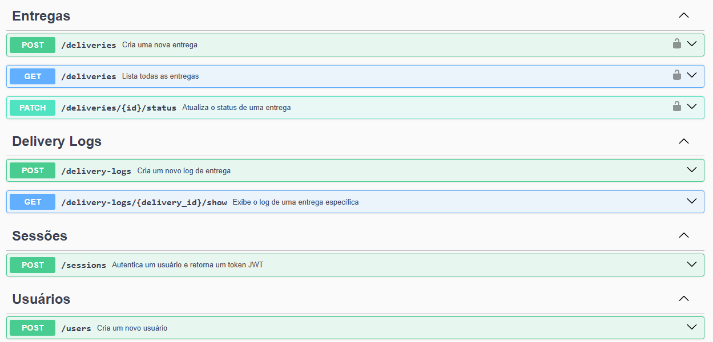

# API Delivery

API para entregas, cadastro e autenticação de usuários, cadastro e atualização de entregas e logs. Além de testes automatizados com jest e supertest.

## Tech Stack
- Node
- Typescript
- Express
- bcrypt
- jsonwebtoken
- prisma
- supertest
- Docker
- Postgres
